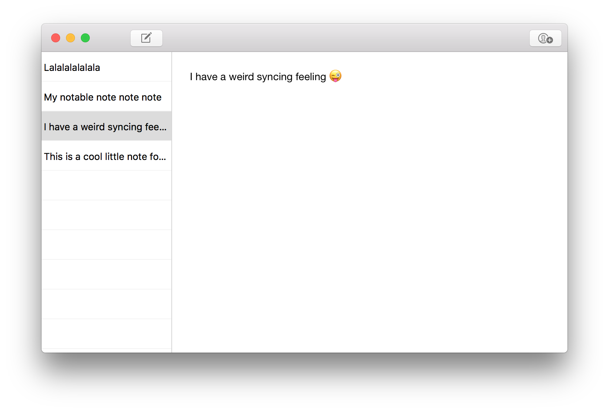

# NoteTaker

A simple note taking app for macOS and iOS which uses [Realm](https://realm.io) and [CloudKit](https://developer.apple.com/icloud) for syncing.

This is a sample project to demonstate an architecture for syncing described in my article on CloudKit.

*Notice: the iOS version of the app only lists the notes and is only available to demonstrate syncing between devices/platforms*



## Building

Building requires:

- Xcode 8.2.1
- Carthage
- Apple Developer account

Before opening the project in Xcode, you must build its dependencies with Carthage (this can take several minutes, but has to be done only once):

```bash
carthage update
```